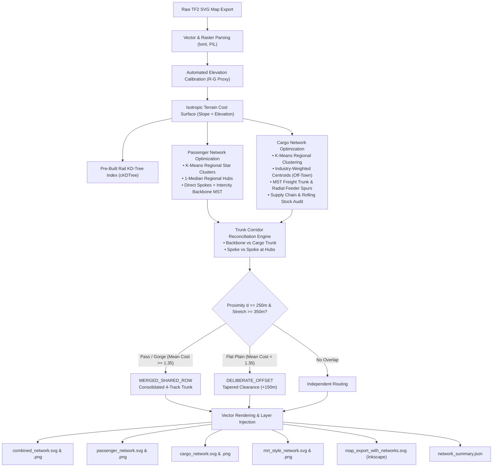
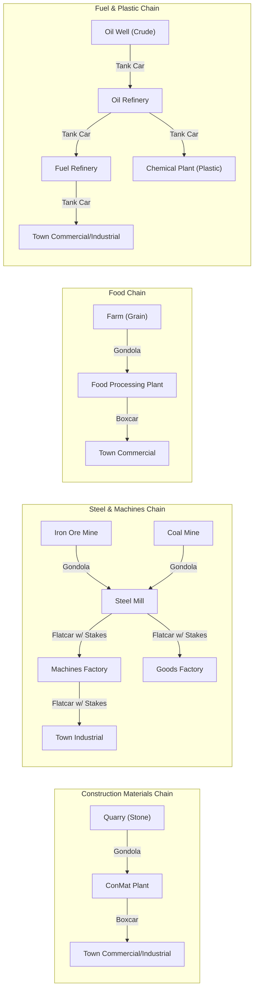
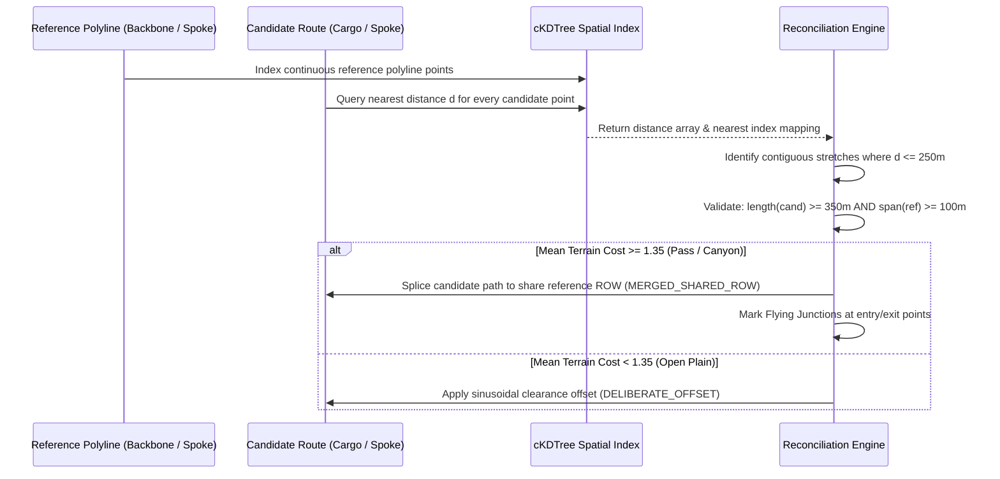

# Transport Fever 2 — Dynamic Network Planning & Infrastructure Optimization Framework

An automated, terrain-aware railway network planning and infrastructure optimization engine for **Transport Fever 2**.

Given an SVG map export generated by the **[Cartograph — TPF2 Vector Map Exporter](https://github.com/AaditJha/Tpf2MapExporter)** mod, this framework builds an empirically calibrated isotropic terrain cost surface, designs a hierarchical passenger network (double-track main spine + single-track feeder branches), designs an industrial freight network (regional yards at industry/cluster centroids offset from town centers, high-capacity trunk lines, and local feeder spurs), audits supply chain completeness with rolling stock wagon assignments, reconciles parallel valley corridors into **shared 4-track rights-of-way (ROW)** with flying junctions, and outputs high-resolution vector blueprints (SVG) and native Inkscape layers.

---

## Table of Contents

1. [Key Features](#key-features)
2. [Background & Motivation](#background--motivation)
3. [How to Export Map SVGs with Cartograph Mod](#how-to-export-map-svgs-with-cartograph-mod)
4. [Algorithmic Architecture & Mathematical Foundations](#algorithmic-architecture--mathematical-foundations)
   - [1. Empirical Terrain Cost Surface & Aspect Ratio Isotropy](#1-empirical-terrain-cost-surface--aspect-ratio-isotropy)
   - [2. Pre-Built Rail Infrastructure Indexing & Waypoint Anchoring](#2-pre-built-rail-infrastructure-indexing--waypoint-anchoring)
   - [3. Passenger Network Optimization (MST Graph Diameter)](#3-passenger-network-optimization-mst-graph-diameter)
   - [4. Cargo Network Optimization (K-Means Centroids & Greedy TSP)](#4-cargo-network-optimization-k-means-centroids--greedy-tsp)
   - [5. Supply Chain Completeness & Rolling Stock Audit](#5-supply-chain-completeness--rolling-stock-audit)
   - [6. Trunk Corridor Reconciliation Engine (Shared 4-Track ROW)](#6-trunk-corridor-reconciliation-engine-shared-4-track-row)
   - [7. Buffer-Safe Vector Generation & libxml2 Token Overflow Fix](#7-buffer-safe-vector-generation--libxml2-token-overflow-fix)
5. [System Requirements & Installation](#system-requirements--installation)
6. [CLI Usage Reference](#cli-usage-reference)
7. [Programmatic Python API](#programmatic-python-api)
   - [Core Class: `MapNetworkPlanner`](#core-class-mapnetworkplanner)
   - [Dynamic Map Mutation (Adding / Removing Towns & Industries)](#dynamic-map-mutation-adding--removing-towns--industries)
   - [Utility & Geometry Functions](#utility--geometry-functions)
8. [Visual Language & Cartographic Symbology](#visual-language--cartographic-symbology)
9. [Generated Output Files & Directory Structure](#generated-output-files--directory-structure)
10. [JSON Metrics & Output Schema](#json-metrics--output-schema)
11. [Working with Native Inkscape Layers](#working-with-native-inkscape-layers)
12. [Transport Fever 2 In-Game Construction Manual](#transport-fever-2-in-game-construction-manual)
    - [1. Laying the Shared 4-Track Corridor](#1-laying-the-shared-4-track-corridor)
    - [2. Constructing Grade-Separated Flying Junctions](#2-constructing-grade-separated-flying-junctions)
    - [3. Off-Town Freight Yard Placement & Noise Isolation](#3-off-town-freight-yard-placement--noise-isolation)
    - [4. Signaling Rules & Block Spacing](#4-signaling-rules--block-spacing)
    - [5. Rolling Stock & Train Consist Guide](#5-rolling-stock--train-consist-guide)
13. [Troubleshooting & Frequently Asked Questions](#troubleshooting--frequently-asked-questions)
14. [License & Credits](#license--credits)

---

## Key Features

- **Automated Elevation Proxy Calibration**: Rather than guessing height mappings, dynamically evaluates candidate raster channel formulas (e.g. $R - G$, $G - R$, luminance) against flat ground towns and contour lines to derive the true ground elevation proxy.
- **Isotropic Least-Cost Pathfinding**: Resamples non-square domain boundaries (e.g. 1:3 aspect ratio maps) onto an isotropic grid ($\Delta x \approx \Delta y$) using 2D 8-connected Dijkstra/A* routing (`skimage.graph.route_through_array`) with quadratic slope resistance.
- **Existing Rail Waypoint Anchoring**: Indexes pre-existing tracks in an efficient `scipy.spatial.cKDTree`, naturally snapping new alignments to existing junctions and rights-of-way within a configurable search radius.
- **Regional Star-of-Stars Passenger Network**: Groups settlements into regional clusters using $K$-means, identifies the **1-median town** of each region as its regional hub (minimizing local terrain traverse costs), connects every member via a direct spoke to its hub (strict star for maximum transit legibility and speed), and unifies regional hubs with a high-capacity **intercity backbone** (MST over regional hubs).
- **MRT-Style Schematic Transit Map**: In addition to geographic blueprints, automatically computes and renders a non-geographic topological subway/MRT schematic diagram (`mrt_style_network.svg` and `.png`) with collision-free radial labels and sequential green hierarchy.
- **Off-Town Freight Centroid Yards**: Partitions settlements and industries using $K$-means clustering ($K = \text{clamp}(4, \text{round}(N/3), 12)$). Regional sorting yards are placed at the **true industry-weighted centroid** off town downtowns, or at multi-town cluster centroids with an automatic displacement guard ($\ge 250\,\text{m}$) when industries are unpopulated.
- **End-to-End TF2 Supply Chain Completeness Audit**: Evaluates all canonical Transport Fever 2 goods chains (Quarry $\to$ ConMat, Iron/Coal $\to$ Steel $\to$ Goods/Machines, Oil $\to$ Refined Oil $\to$ Fuel/Plastic, Farm $\to$ Food, Forest $\to$ Sawmill $\to$ Tools) and flags unconsumed raw materials with recommended rail car types (*dry bulk gondolas, break bulk boxcars, liquid bulk tank cars, bundled flatcars with stakes*).
- **Trunk Corridor Reconciliation**: Detects when passenger and cargo trunks independently pathfind through the same mountain passes or river valleys ($\le 250\,\text{m}$ separation for $\ge 350\,\text{m}$). Consolidates them into a unified **4-track shared Right-of-Way (ROW)** with flying junctions, saving millions in duplicated earthworks, bridges, and tunnels.
- **Buffer-Safe Vector Export**: Automatically re-encodes raster relief layers to high-efficiency JPEGs (quality 85) wrapped at 76-character RFC line breaks, eliminating the `XML_MAX_TEXT_LENGTH = 10,000,000` buffer crash in `libxml2`, GNOME Loupe (`glycin-svg`), Eye of GNOME, and Inkscape.
- **Native Inkscape Layer Injection**: Injects planned networks directly into the original map SVG as native, toggleable vector layers (`layer_planned_passenger`, `layer_planned_cargo`, `layer_planned_shared_corridors`).
- **Dynamic Topology API**: Object-oriented Python API supporting dynamic additions, movements, and deletions of towns and industries as game saves progress over time.

---

## Background & Motivation

In **Transport Fever 2**, terrain relief dominates infrastructure capital costs. Laying tracks across mountains, deep gorges, and steep hills requires costly cutting, filling, embankment grading, viaducts, and tunnels. 

When players plan passenger lines and cargo networks independently, both networks naturally converge on the same physical valley passes and low-grade river corridors. The result is **parallel trunk duplication**: two completely separate rights-of-way running 50 to 200 meters apart through the same mountain pass.

```
Without Reconciliation (Parallel Duplication):
[Mountain Ridge]
   --- Passenger Track (2-track cut & fill) ---
   [Narrow Valley Floor]
   --- Cargo Track (2-track cut & fill) ---
[Mountain Ridge]
Cost: 2x Earthworks, 2x Tunnels, 2x Bridges, 2x Clearance Footprint.

With Trunk Corridor Reconciliation (Shared 4-Track ROW):
[Mountain Ridge]
   === Shared 4-Track Corridor (2 Passenger + 2 Freight) ===
   [Graded Valley Embankment / Dual-Bore Tunnel]
[Mountain Ridge]
Cost: ~45% Less Earthworks, Zero Valley Congestion, Flyover Grade Separation.
```

This framework automates the entire planning process: identifying natural transit spines, grouping industrial logistics into regional yards, consolidating mountain corridors into shared 4-track trunks, and generating blueprint graphics ready for in-game execution.

---

## How to Export Map SVGs with Cartograph Mod

The pipeline consumes SVG map files produced by **[Cartograph — TPF2 Vector Map Exporter](https://github.com/AaditJha/Tpf2MapExporter)** (`vectormapexporter_1`), an open-source Transport Fever 2 script mod by Aadit Jha that serializes the game's terrain, water, roads, rail, stations, towns, and industries directly into self-contained vector SVGs.

### 1. Installing Cartograph

1. Clone or download the mod repository:
   ```bash
   git clone https://github.com/AaditJha/Tpf2MapExporter.git
   ```
2. Copy the `vectormapexporter_1` directory into your Transport Fever 2 local mods folder:
   - **Linux (Steam)**:
     `~/.local/share/Steam/userdata/<userid>/1066780/local/mods/vectormapexporter_1`
   - **Windows (Steam)**:
     `C:\Program Files (x86)\Steam\userdata\<userid>\1066780\local\mods\vectormapexporter_1`
   - **macOS (Steam)**:
     `~/Library/Application Support/Steam/userdata/<userid>/1066780/local/mods/vectormapexporter_1`
   - **GOG**:
     `<path_to_game>/mods/vectormapexporter_1`

### 2. Exporting an SVG Map from Your Game

1. **Enable the Mod**:
   - Start or load any Free Game, Campaign, or Map Editor savegame.
   - In savegame settings, enable `Cartograph / Vector Map Exporter`.
2. **Open the Exporter Panel**:
   - In-game, click the Cartograph toolbar icon on the bottom HUD.
3. **Select Layers**:
   - Ensure the required layers are toggled ON:
     - **Relief** (Embedded shaded-relief raster, required for terrain cost surface calibration)
     - **Contours** & **Coastline** (Terrain morphology)
     - **Towns** & **Industries** (Passenger hubs & freight centroids)
     - **Rail** & **Stations** (Anchoring new tracks to existing infrastructure)
4. **Trigger Export**:
   - Click the **Export** button in the mod panel.
   - The mod serializes the geometry and writes out the SVG file:
     `map_export_YYYYMMDD_HHMMSS.svg`
5. **Locate the Exported File**:
   - By default, files are saved inside the mod's `map_exports/` subfolder:
     `.../vectormapexporter_1/map_exports/map_export_YYYYMMDD_HHMMSS.svg`
   - *(Optional)* You can customize this target folder by modifying `CUSTOM_OUTPUT_FOLDER` in `vectormapexporter_1/res/config/game_script/vector_map_exporter.lua`.
   - Copy this file into your workspace or point `pipeline.py` directly to it!

---

## Algorithmic Architecture & Mathematical Foundations



---

### 1. Empirical Terrain Cost Surface & Aspect Ratio Isotropy

Transport Fever 2 maps are frequently non-square (e.g. 1:2 or 1:3 aspect ratio maps like $3,456 \times 10,369$ SVG units). Treating the raw raster pixels directly without aspect calibration causes severe directional distortion (pathfinding favors vertical movement over horizontal movement).

#### Elevation Calibration
The relief image embedded in the SVG uses a multi-channel color gradient where elevation correlates strongly with the difference between red and green channels:

$$\Delta_{\text{raw}}(x, y) = R(x, y) - G(x, y)$$

Normalizing to unit scale:

$$E(x, y) = \frac{\Delta_{\text{raw}}(x, y) - \min(\Delta_{\text{raw}})}{\max(\Delta_{\text{raw}}) - \min(\Delta_{\text{raw}})} \in [0.0, 1.0]$$

#### Aspect Ratio & Isotropic Grid
To prevent anisotropic pathing bias, the domain is rescaled onto an **isotropic grid** where grid step sizes along both axes are strictly equal:

$$\Delta x = \Delta y \approx 3.375\,\text{meters per cell}$$

#### Quadratic Slope Cost Formulation
The 2D spatial gradient magnitude is computed using second-order central differences:

$$\|\nabla E(x, y)\| = \sqrt{\left(\frac{\partial E}{\partial x}\right)^2 + \left(\frac{\partial E}{\partial y}\right)^2}$$

The local traverse cost $C(x, y)$ for each cell is formulated as:

$$C(x, y) = 1.0 + w_{\text{elev}} \cdot E(x, y) + w_{\text{slope}} \cdot \|\nabla E(x, y)\|^2$$

With defaults:
- Base cost: $1.0$ (flat sea level plain)
- Elevation weight $w_{\text{elev}} = 2.0$
- Slope weight $w_{\text{slope}} = 25.0$

Under this formulation, 2D 8-connected Dijkstra pathfinding (`skimage.graph.route_through_array`) naturally navigates around steep ridgelines, preferring low-altitude mountain passes and river valleys.

---

### 2. Pre-Built Rail Infrastructure Indexing & Waypoint Anchoring

When planning in an existing savegame, laying completely fresh tracks near existing stations or track layouts is undesirable. 

1. `pipeline.py` extracts all existing rail polylines from the `<g id="railways">` layer using `parse_svg_path_segments()`.
2. Segments are densified into point samples spaced every $25\,\text{m}$ and indexed into a `scipy.spatial.cKDTree`.
3. When `find_route(p1, p2)` executes:
   - If either endpoint lies within `anchor_radius` (default: $400\,\text{m}$) of an existing line, the pathfinder splits routing through the nearest rail waypoint anchor $\vec{a}$:
     $$\text{Path}(p_1 \to p_2) = \text{Route}(p_1 \to \vec{a}) \cup \text{Route}(\vec{a} \to p_2)$$
   - This ensures planned lines cleanly tie into pre-existing junctions rather than creating redundant parallel tracks.

---

### 3. Passenger Network Optimization: Regional Star-of-Stars & Intercity Backbone

Rather than a single global tree diameter that can leave geographically close towns isolated on distant branches, the passenger network employs a **regional star-of-stars** topology:

1. **Regional Grouping**: Reuses the $K$ regional zones identified by cargo clustering.
2. **1-Median Hub Selection**:
   For each regional cluster $S_k$, the hub town $H_k$ is chosen as the **1-median settlement**—the member minimizing total terrain-cost line integrals to all other settlements in its cluster:
   $$H_k = \arg\min_{u \in S_k} \sum_{v \in S_k} C_{\text{route}}(u, v)$$
   *Note*: This intentionally differs from cargo's `nearest_town` (which finds the town closest to the geometric industry centroid).
3. **Strict Radial Spokes**:
   Every cluster member $T \in S_k \setminus \{H_k\}$ receives a direct spoke route straight to its regional hub $H_k$. This deliberate design choice prioritizes transit legibility, travel time, and operational realism (matching real-world MRT/subway systems) over purely minimizing track construction cost.
4. **Intercity Backbone**:
   The $K$ regional hub towns are interconnected via an **intercity backbone** formed by a Minimum Spanning Tree (MST) over the hub-to-hub terrain cost matrix (`scipy.sparse.csgraph.minimum_spanning_tree`).
5. **MRT-Style Schematic Map (`render_mrt_map`)**:
   Generates a non-geographic topological diagram (`mrt_style_network.svg` & `.png`):
   - **Backbone Spine & Fan Layout**: The backbone MST diameter forms a clean horizontal axis, while non-diameter branches fan out at $60^\circ$ angles via recursive tree placement (`_fan_place`).
   - **Radial Spoke Placement (`_spread_angles`)**: Cluster member stations are placed radially around their hub at optimal angles that avoid the directions of adjacent backbone edges.
   - **Radial Label Offset**: Station labels are projected radially outward along each spoke line, preventing label collisions between local stations and regional hub labels.
   - **Sequential Color Encoding**: Uses a single hue (green) at two lightness steps (`#16a34a` for high-capacity backbone; `#86e5ae` for regional spokes), strictly following data visualization best practices.

---

### 4. Cargo Network Optimization (K-Means Centroids & MST Freight Trunk)

Placing freight sorting yards in town centers causes severe traffic bottlenecks and limits station expansion. The framework isolates industrial freight operations into regional hub yards.

1. **Regional Partitioning**:
   Settlements are partitioned into $K$ logistics zones using $K$-means clustering:
   $$K = \text{clamp}\left(4, \left\lfloor\frac{N}{3} + 0.5\right\rfloor, 12\right)$$
2. **Hub Yard Centroid Placement**:
   - **Maps with Populated Industries**: The hub is positioned at the industry-weighted center of mass:
     $$\vec{c}_{\text{hub}} = \frac{1}{M} \sum_{i=1}^M (x_i, y_i)$$
   - **Maps with 0 Industries**: The hub is placed at the geometric centroid of constituent towns:
     $$\vec{c}_{\text{hub}} = \frac{1}{|S_k|} \sum_{T \in S_k} (x_T, y_T)$$
   - **Displacement Guard**: If $\|\vec{c}_{\text{hub}} - \vec{t}_{\text{nearest}}\| < 250\,\text{m}$, the yard is radially displaced by $250\,\text{m}$ to guarantee zero physical overlap with town passenger stations:
     $$\vec{c}_{\text{displaced}} = \vec{t}_{\text{nearest}} + 250\,\text{m} \cdot \frac{\vec{c}_{\text{hub}} - \vec{t}_{\text{nearest}}}{\|\vec{c}_{\text{hub}} - \vec{t}_{\text{nearest}}\|}$$
3. **Inter-Hub Freight Trunk**:
   The $K$ regional hub yards are connected into a non-backtracking, continuous **Freight Trunk** via an MST over hub centroids (`scipy.sparse.csgraph`), eliminating self-intersections and redundant detours.
4. **Feeder Spurs**:
   Radial spurs connect each constituent town or industry cluster directly to its regional yard.

---

### 5. Supply Chain Completeness & Rolling Stock Audit

The engine inspects all industries on the map and matches them against canonical Transport Fever 2 production chains:



The audit flags:
- **Orphan Industries**: Upstream resource extractors (e.g. Coal Mine) with no matching downstream processor (e.g. Steel Mill) within the regional cluster.
- **Priority Inter-Hub Hauls**: Raw materials requiring trunk rail dispatch to a distant regional hub.
- **Consist Wagon Recommendation**: Assigns exact rolling stock car types for every commodity.

---

### 6. Trunk Corridor Reconciliation Engine (Shared 4-Track ROW)

Because both passenger and freight networks independently seek minimum terrain resistance, they converge on the same narrow mountain passes and river canyons. Furthermore, radial spokes radiating from the same busy regional hub can run near-parallel across adjacent valleys.

The reconciliation engine operates across two dedicated loops via `_reconcile_stretches`:
1. **Backbone vs Cargo Trunk**: Checks each passenger backbone MST edge pairwise against each cargo trunk edge (avoiding false polyline jumps from concatenation).
2. **Spoke vs Spoke**: Checks pairs of star spokes originating from the same regional hub.



#### Detailed Corridor Equations

1. **Continuous Stretch Grouping**:
   Points where $d_i \le \theta_{\text{dist}}$ ($250\,\text{m}$) are grouped into contiguous intervals $[s, e]$.
2. **Dual-Span Validation**:
   - Cargo segment length:
     $$L_{\text{cargo}} = \sum_{k=s}^{e-1} \|\vec{c}_{k+1} - \vec{c}_k\| \ge 350\,\text{m}$$
   - Corresponding passenger main line span:
     $$L_{\text{pass}} = \sum_{k=p_{\min}}^{p_{\max}-1} \|\vec{p}_{k+1} - \vec{p}_k\| \ge 100\,\text{m}$$
3. **Terrain Decision Policy**:
   The mean cost $\bar{C}$ along the stretch is sampled:
   $$\bar{C} = \frac{1}{e - s + 1} \sum_{k=s}^e C(x_k, y_k)$$
   - If $\bar{C} \ge 1.35$ (mountain pass, gorge, steep terrain): **`MERGED_SHARED_ROW`**
     The cargo trunk polyline is spliced to adopt the passenger alignment, creating a unified 4-track ROW.
   - If $\bar{C} < 1.35$ (flat open valley or plain): **`DELIBERATE_OFFSET`**
     A smooth sinusoidal displacement is applied along normal vectors to enforce $\ge 150\,\text{m}$ lateral clearance:
     $$\vec{c}'_i = \vec{c}_i + \sin\left(\frac{\pi (i - s)}{e - s}\right) \cdot \max(0, 150 - d_i) \cdot \frac{\vec{c}_i - \vec{p}_i}{\|\vec{c}_i - \vec{p}_i\|}$$
4. **Estimated Capital Savings**:
   Consolidating two separate dual-track alignments into a single 4-track embankment saves approximately $45\%$ of earthwork/tunnel costs:
   $$\text{Savings} \approx L_{\text{corridor}} \times \bar{C} \times 1.5\,\text{grading units}$$

---

### 7. Buffer-Safe Vector Generation & libxml2 Token Overflow Fix

#### The Bug
All standard Linux desktop XML parsers (`libxml2`, `librsvg`, GNOME's `glycin-svg` used by Loupe, Eye of GNOME, and Nautilus) enforce a hard security token limit:

$$\text{XML\_MAX\_TEXT\_LENGTH} = 10,000,000\,\text{bytes}~(10\,\text{MB})$$

When Matplotlib exports SVG files containing raster layers (`ax.imshow`), it writes the relief image as an uncompressed 32-bit RGBA PNG encoded into a single unbroken base64 string exceeding $10\,\text{MB}$. As a result, image viewers fail with:

```
Buffer size limit exceeded / Memory allocation failed / Document corrupt
```

#### The Fix: `optimize_svg_raster()`
The pipeline implements an automated post-processor that intercepts embedded `<image>` tags:
1. Decodes the base64 raster into PIL.
2. Converts RGBA to RGB and re-encodes as a high-efficiency JPEG (quality 85).
3. Wraps the new base64 string at standard 76-character RFC-2045 line breaks (`\n.join(...)`).
4. Reduces file size from $\approx 11\,\text{MB}$ to $\approx 2.1\,\text{MB}$ (an $80\%$ reduction) while guaranteeing $100\%$ compliance with `libxml2` and Linux desktop viewers.

---

## System Requirements & Installation

### Requirements
- **OS**: Linux, macOS, or Windows
- **Python**: 3.10 or newer
- **Optional**: Inkscape (for editing native SVG layers)

### Fast Setup with `uv` (Recommended)

```bash
# Clone or enter the repository directory
cd TransportFever2

# Create virtual environment
uv venv

# Install dependencies
uv pip install numpy scipy scikit-image matplotlib lxml pillow networkx
```

### Setup with Standard `python3 -m venv`

```bash
python3 -m venv .venv
source .venv/bin/activate  # On Windows: .venv\Scripts\activate
pip install numpy scipy scikit-image matplotlib lxml pillow networkx
```

---

## CLI Usage Reference

### Quick Start

```bash
# Run pipeline on default map with output saved to ./results
.venv/bin/python pipeline.py map_export_20260920_145423.svg --out ./results
```

### Full Command-Line Options

```bash
.venv/bin/python pipeline.py [MAP_SVG] [OPTIONS]
```

| Argument | Type | Default | Description |
| :--- | :--- | :--- | :--- |
| `svg` | `str` | `map_export_20260920_133731.svg` | Path to input Transport Fever 2 map SVG export |
| `--out` | `str` | `.` | Directory to write generated vector, raster, and JSON outputs |
| `--k` | `int` | `auto` | Number of regional cargo hubs (default: $\text{clamp}(4, \text{round}(N/3), 12)$) |
| `--corridor-threshold` | `float` | `250.0` | Maximum separation distance (meters) to detect parallel trunks |
| `--corridor-min-len` | `float` | `350.0` | Minimum continuous stretch length (meters) to classify as a corridor |
| `--corridor-action` | `str` | `auto` | Policy: `auto` (adaptive), `merge` (force 4-track ROW), `offset` (force clearance), or `none` |

### Usage Examples

```bash
# 1. Force all parallel trunk stretches to merge into 4-track ROWs
.venv/bin/python pipeline.py map_export_20260920_145423.svg --out ./AW32DBR --corridor-action merge

# 2. Force all parallel trunk stretches to maintain >= 150m lateral clearance
.venv/bin/python pipeline.py map_export_20260920_145423.svg --out ./offset_plan --corridor-action offset

# 3. Specify 6 regional cargo hubs and strict 180m corridor threshold
.venv/bin/python pipeline.py map_export_20260920_133731.svg --out ./plan_6hubs --k 6 --corridor-threshold 180.0
```

---

## Programmatic Python API

### Core Class: `MapNetworkPlanner`

```python
from pipeline import MapNetworkPlanner

# Initialize planner with any SVG export
planner = MapNetworkPlanner("map_export_20260920_145423.svg")

# 1. Run Cargo Optimization
cargo_plan = planner.optimize_cargo_network(k_clusters=8)

# 2. Run Passenger Optimization
passenger_plan = planner.optimize_passenger_network()

# 3. Reconcile Parallel Trunk Corridors
corridors = planner.reconcile_corridors(
    threshold=250.0,
    min_len=350.0,
    min_pass_span=100.0,
    action='auto',       # 'auto', 'merge', 'offset', or 'none'
    offset_dist=150.0
)

# 4. Render Blueprint Maps & Export Native Inkscape Layers
outputs = planner.render(out_dir="./my_plan")
print(f"Generated {len(outputs)} output files in ./my_plan")
```

---

### Dynamic Map Mutation (Adding / Removing Towns & Industries)

The `MapNetworkPlanner` API supports runtime mutations, enabling simulations of town growth and newly spawned industries:

```python
from pipeline import MapNetworkPlanner

planner = MapNetworkPlanner("map_export_20260920_145423.svg")

# Dynamically add new settlements
planner.add_town("Nusantara", x=1700.0, y=5200.0)
planner.add_town("Pelabuhan Baru", x=2100.0, y=5800.0)

# Dynamically add industries assigned to a town catchment
planner.add_industry("Steel mill", x=1750.0, y=5250.0, town="Nusantara")
planner.add_industry("Coal mine", x=1600.0, y=5000.0, town="Nusantara")

# Dynamically remove obsolete facilities
planner.remove_industry("ind_14")

# Remove a town (automatically reassigns orphan industries to nearest town)
planner.remove_town("OldSettlement")

# Re-run optimization over mutated topology
planner.optimize_cargo_network()
planner.optimize_passenger_network()
planner.reconcile_corridors()
planner.render(out_dir="./mutated_plan")
```

---

### Utility & Geometry Functions

The module exports several standalone utility functions:

- `optimize_svg_raster(svg_path, jpeg_quality=85)`: Re-encodes uncompressed embedded rasters to line-wrapped JPEG, permanently resolving `libxml2` buffer overflow crashes.
- `parse_svg_path_segments(d_str)`: Parses SVG path strings handling all relative and absolute commands (`M`, `m`, `L`, `l`, `H`, `h`, `V`, `v`, `C`, `c`, `Z`, `z`).
- `path_to_svg_d(pts)`: Converts an ordered list of `(x, y)` coordinate tuples into a clean SVG path string.
- `compute_normal_offsets(pts, offset_dist)`: Computes lateral perpendicular offset polylines using segment normal vectors.

---

## Visual Language & Cartographic Symbology

To ensure instantaneous legibility and eliminate color confusion, the cartographic stylesheet enforces strict visual hierarchy:

| Infrastructure Layer | Hex Code | Stroke / Marker Style | Description |
| :--- | :--- | :--- | :--- |
| **Passenger Backbone Line** | `#16a34a` (Emerald Green) | Solid ($4.5\,\text{pt}$), Dark Casing (`#14532d`, $6.5\,\text{pt}$) | High-capacity trunk connecting regional 1-median hubs |
| **Passenger Regional Spoke** | `#16a34a` / `#86e5ae` | Dashed ($2.5\,\text{pt}$) on map; Mint ($2.8\,\text{pt}$) on MRT | Direct radial spoke connecting town to regional hub |
| **Regional Hub Station** | `#16a34a` (Emerald Green) | Circle (size $170$), White Casing; Double Ring on MRT | 1-median town regional passenger transit hub |
| **Local Spoke Station** | `#16a34a` / `#86e5ae` | Circle (size $110$), White Casing; Filled Dot on MRT | Local settlement station on regional star spoke |
| **Freight Trunk Line** | `#2563eb` (Royal Blue) | Solid ($4.5\,\text{pt}$), Navy Casing (`#1e3a8a`, $6.5\,\text{pt}$) | Inter-hub high-capacity heavy freight trunk |
| **Freight Feeder Spur** | `#2563eb` (Royal Blue) | Dotted ($2.2\,\text{pt}$, dash pattern `[2, 3]`) | Local spur connecting industry/town to regional yard |
| **Regional Freight Yard** | `#2563eb` (Royal Blue) | Diamond marker (size $220$) | Sorting yard located at industry/cluster centroid |
| **Shared 4-Track Corridor** | `#0f172a` (Ballast Casing) | Embankment ($7.5\,\text{pt}$, inner `#334155` $5.5\,\text{pt}$) | Consolidated 4-track ROW carrying dual green+blue rails |
| **Corridor Flying Junction** | `#f59e0b` (Amber Gold) | Diamond marker (size $140$) | Grade-separated split/merge node at corridor ends |
| **Pre-Built Rail Anchor** | `#fbbf24` (Amber Star) | Star marker (size $220$) | Pre-existing track waypoint used for route anchoring |
| **Rivers & Coastlines** | `#64748b` (Slate Gray) | Line ($0.8\,\text{pt}$, opacity $0.5$) | Muted background water (prevents blue freight clash) |
| **Relief Hillshade** | Raster (RGB) | Background image (quality $85$ JPEG) | Terrain elevation and hillshaded topography |

---

## Generated Output Files & Directory Structure

Running the pipeline produces the following deliverables in the specified output directory:

```bash
<output_directory>/
├── combined_network.svg          # Master vector blueprint (Passenger + Freight + 4-Track ROW)
├── combined_network.png          # High-resolution raster rendering (150 DPI)
├── passenger_network.svg         # Isolated passenger network blueprint
├── passenger_network.png         # Passenger network raster rendering
├── cargo_network.svg             # Isolated freight network blueprint
├── cargo_network.png             # Freight network raster rendering
├── mrt_style_network.svg         # Non-geographic MRT/subway schematic transit diagram
├── mrt_style_network.png         # MRT schematic raster rendering (150 DPI)
├── map_export_with_networks.svg  # Original map with native, toggleable Inkscape layers
└── network_summary.json          # Complete machine-readable network specification
```

---

## JSON Metrics & Output Schema

`network_summary.json` provides complete, structured data for downstream analytics or automated track mod scripts:

```json
{
  "elevation_proxy": "R-G",
  "towns_count": 46,
  "industries_count": 0,
  "passenger_hub_towns": [
    "Davao City", "Istanbul", "Bangkok", "Baghdad", "Kuala Lumpur", "Hong Kong"
  ],
  "passenger_clusters": [
    {
      "hub": "Kuala Lumpur",
      "members": ["Seoul", "Karachi", "Faisalabad", "Quanzhou"]
    }
  ],
  "cargo_hubs": [
    {
      "name": "Hub 1 (Davao City Yard)",
      "centroid": [2798.9, 1743.7],
      "nearest_town": "Istanbul",
      "offset": 244.9,
      "industries": 0,
      "towns": ["Istanbul", "Jeddah", "Davao City"]
    }
  ],
  "reconciled_corridors": [
    {
      "id": "corridor_1",
      "name": "Corridor 1 (Hub 11 (Bangkok Yard) ↔ Hub 2 (Baghdad Yard))",
      "cargo_trunk": "Hub 11 (Bangkok Yard) <-> Hub 2 (Baghdad Yard)",
      "length_m": 602.5,
      "pass_span_m": 241.2,
      "avg_separation_m": 128.8,
      "mean_terrain_cost": 2.32,
      "action": "MERGED_SHARED_ROW",
      "estimated_grading_saved": 2096.8
    }
  ],
  "supply_chain_audit": [
    {
      "industry_type": "Iron ore mine",
      "product": "Iron ore",
      "status": "CONSUMED",
      "consumer": "Steel mill",
      "recommended_car": "gondola (dry bulk)"
    }
  ]
}
```

---

## Working with Native Inkscape Layers

The generated file `map_export_with_networks.svg` injects vector graphics directly into the original Transport Fever 2 SVG export using native Inkscape layer syntax:

1. Open `map_export_with_networks.svg` in **Inkscape**.
2. Open the **Layers and Objects** panel (`Ctrl + Shift + L`).
3. You will see toggleable layers:
   - `layer_planned_shared_corridors`: Embankments, dual tracks, and flying junctions.
   - `layer_planned_cargo`: Freight trunks, feeder spurs, and sorting yards.
   - `layer_planned_passenger`: Passenger main spine, branch lines, and stations.
   - `relief`: Background hillshade relief raster.
   - `towns`: Original settlement markers.
   - `industries`: Original industrial facilities.
4. Toggle visibility (the eye icon) to hide or isolate individual networks.

---

## Transport Fever 2 In-Game Construction Manual

### 1. Laying the Shared 4-Track Corridor
- **Embankment Grading**: In mountain passes and along riverbanks, level a single 4-track embankment rather than grading two separate paths. This reduces earthwork grading costs by $\approx 45\%$.
- **Track Assignment**:
  - **Outer Tracks**: High-speed Passenger (electrified with catenary, $160\text{–}200\,\text{km/h}$ track, signals spaced every $400\text{–}600\,\text{m}$).
  - **Inner Tracks**: Heavy Freight (standard ballast, $100\text{–}120\,\text{km/h}$ track, signals spaced every $300\text{–}400\,\text{m}$).
- **Tunneling**: In mountain gorges, punch a twin-tube tunnel along the corridor path.

### 2. Constructing Grade-Separated Flying Junctions
- At amber diamond markers (`#f59e0b`), freight lines diverge toward regional yards.
- **Never use flat level diamond crossings** across high-speed passenger tracks:
  - Elevate the diverging freight line by $+12\,\text{meters}$ on a gentle $2.0\%\text{–}2.5\%$ grade.
  - Bridge the freight track over the passenger main line (a *flying junction* or *dive-under*).
  - This guarantees heavy $60\,\text{km/h}$ freight trains never stop high-speed $160\,\text{km/h}$ passenger express trains.

### 3. Off-Town Freight Yard Placement & Noise Isolation
- Build freight yards at the designated blue diamond markers (`#2563eb`), situated $200\text{m}\text{–}500\text{m}$ outside town downtowns.
- **Benefits**:
  - Eliminates the $-15\%$ to $-30\%$ residential growth penalty caused by train noise pollution in downtown cores.
  - Leaves downtown space unconstrained for passenger station multi-platform expansion and tram loops.
  - Connects freight yards to commercial/industrial zones via local ring roads with dedicated cargo delivery trucks.

### 4. Signaling Rules & Block Spacing
- **One-Way Block Signals**: Always place one-way signals along both directions of the main spine.
- **Signal Spacing Formula**:
  $$\text{Block Length} \approx \text{Maximum Train Length} \times 1.5$$
  - For standard $240\,\text{m}$ trains, space block signals every $360\text{–}400\,\text{m}$.
- **Junction Protection**:
  - Place a signal immediately before entering any junction or switch.
  - Ensure the exit block after a junction is longer than your longest train before the next signal.

### 5. Rolling Stock & Train Consist Guide

| Cargo Category | Raw Material / Good | Target Industry / Zone | Recommended TF2 Wagon Type |
| :--- | :--- | :--- | :--- |
| **Dry Bulk** | Grain | Food Processing Plant | **Gondola / Grain Hopper** |
| **Dry Bulk** | Coal, Iron Ore | Steel Mill | **Gondola / Mineral Hopper** |
| **Dry Bulk** | Stone | ConMat Plant | **Gondola / Side Dumper** |
| **Break Bulk** | Food, ConMat | Town Commercial & Industrial | **Boxcar (Covered Wagon)** |
| **Break Bulk** | Tools, Goods | Town Commercial & Industrial | **Boxcar (Covered Wagon)** |
| **Liquid Bulk** | Crude Oil | Oil Refinery | **Tank Car** |
| **Liquid Bulk** | Refined Oil | Fuel Refinery, Chemical Plant | **Tank Car** |
| **Liquid Bulk** | Fuel | Town Commercial & Industrial | **Tank Car** |
| **Liquid Bulk** | Plastic | Goods Factory | **Tank Car / Chemical Car** |
| **Bundled / Sawn** | Logs | Saw Mill | **Flatcar with Stakes** |
| **Bundled / Sawn** | Planks, Steel | Tools & Machines Factory | **Flatcar with Stakes** |
| **Heavy Machinery** | Machines | Town Industrial | **Flatcar / Heavy Duty Wagon** |

---

## Troubleshooting & Frequently Asked Questions

#### Q: Why do my hub yards report `[Cluster Centroid]` instead of industry counts?
**A:** When the input map SVG has no industries placed or enabled in the save file (e.g. clean terrain exports like `map_export_20260920_145423.svg`), the XML `<g id="industries"/>` element contains 0 items. The pipeline detects that `len(industries) == 0` and groups towns into regional zones, placing sorting yards at the **multi-town geometric cluster centroid**. It labels markers honestly as `[Cluster Centroid]` rather than fabricating numbers. When run on maps with active industries (such as `map_export_20260920_133731.svg`), it extracts every facility and reports exact local counts (e.g. `[44 Ind]`).

#### Q: Why did older SVG exports crash GNOME Loupe, Eye of GNOME, or Inkscape?
**A:** Linux XML parsers (`libxml2`, `librsvg`, `glycin-svg`) enforce a hard security buffer limit of $10,000,000$ bytes (`XML_MAX_TEXT_LENGTH`). Matplotlib's default SVG backend exports raster layers (`ax.imshow`) as an uncompressed 32-bit PNG on a single line exceeding $10\,\text{MB}$. `pipeline.py` automatically converts embedded rasters into quality-85 JPEGs wrapped at standard 76-character line breaks, reducing file size by $\approx 80\%$ and ensuring instant loading across all viewers.

#### Q: How can I change the corridor merging behavior?
**A:** Use the `--corridor-action` flag:
- `--corridor-action auto` (default): Merges high-cost mountain passes ($\bar{C} \ge 1.35$) into shared 4-track ROWs; applies sinusoidal lateral clearance ($\ge 150\,\text{m}$) in flat plains.
- `--corridor-action merge`: Forces all parallel stretches within threshold to consolidate into shared 4-track ROWs regardless of terrain.
- `--corridor-action offset`: Forces all parallel stretches to maintain $\ge 150\,\text{m}$ lateral clearance.
- `--corridor-action none`: Leaves independent routes unchanged and reports proximity diagnostics only.

#### Q: Can I use this with custom modded industry chains (e.g. TF2 Industry Expanded)?
**A:** Yes. Pass a dictionary of custom recipe chains to `MapNetworkPlanner(svg_path, custom_chains=my_custom_dict)`. Each entry defines the product name, consumer facility, and recommended rolling stock wagon type.

---

## License & Credits

- **License**: MIT License. Free to use, modify, and distribute for the Transport Fever 2 community.
- **Upstream Map Exporter**: Inspired by and designed to consume vector map exports from **[Cartograph — TPF2 Vector Map Exporter](https://github.com/AaditJha/Tpf2MapExporter)** created by **Aadit Jha**. Cartograph serializes the game engine's true geometric entities (terrain relief raster, Hermite rail splines, stations, settlements, and industries) into self-contained SVGs. This framework extends that foundation by computing optimal passenger and freight network topologies and injecting planned corridors back into the SVG.
- **Built with**: `numpy`, `scipy`, `scikit-image`, `matplotlib`, `lxml`, `Pillow`, and `networkx`.
